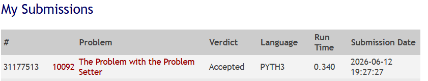

# UVA 10092 - The Problem with the Problem Setter

## Link do Video de Apresentaçao:


## Informações Gerais

| Item | Detalhe |
|---|---|
| **Problema** | The Problem with the Problem Setter |
| **Plataforma** | UVA Online Judge |
| **Link** | [https://onlinejudge.org/external/100/10092.pdf](https://onlinejudge.org/external/100/10092.pdf) |
| **Linguagem** | Python 3 |
| **Algoritmo** | Edmonds-Karp (Fluxo Máximo via BFS) |

## Integrantes do Grupo

| Nome |
|---|
| João Victor Lira Saraiva Leão|
| ISADORA FERREIRA NEVES RIOS | 
| CAUAN GOMES DOS SANTOS BARBOSA |

---

## Como Executar

### Pré-requisitos

- Python 3.6 ou superior

### Execução

```bash
# A partir da raiz do repositório
python src/main.py < dados/entrada_exemplo.txt
```

No PowerShell (Windows):

```powershell
Get-Content dados/entrada_exemplo.txt | python src/main.py
```

A solução lê da entrada padrão (stdin) e escreve na saída padrão (stdout), no formato exigido pelo UVA Online Judge.

---

## Descrição do Problema

Um elaborador de provas possui **nk** categorias de problemas e **np** problemas disponíveis. Cada categoria exige uma quantidade específica de problemas. Cada problema pode pertencer a uma ou mais categorias, mas **só pode ser utilizado uma vez** na prova (atribuído a no máximo uma categoria).

O objetivo é determinar se é possível selecionar problemas para atender à demanda de todas as categorias. Em caso positivo, imprimir uma atribuição válida.

### Entrada

- Múltiplos casos de teste, cada um começando com `nk np`
- Segunda linha: `nk` inteiros com a demanda de cada categoria
- Próximas `np` linhas: para cada problema, o número de categorias a que pertence seguido dos índices dessas categorias
- Entrada termina com `0 0`

### Saída

- Se possível: imprime `1` seguido de `nk` linhas, cada uma com os índices dos problemas atribuídos àquela categoria
- Se impossível: imprime `0`

---

## Modelagem como Rede de Fluxo

O problema é modelado como uma rede de fluxo com a seguinte estrutura:

### Vértices

| Vértice | Significado |
|---|---|
| `0` (source) | Origem — representa o total de problemas que precisam ser distribuídos |
| `1` a `nk` | Categorias — cada uma precisa receber uma quantidade específica de problemas |
| `nk+1` a `nk+np` | Problemas — cada problema disponível no banco |
| `nk+np+1` (sink) | Sorvedouro — representa a conclusão da seleção |

### Arestas e Capacidades

```
Source ──(demanda[i])──> Categoria_i ──(1)──> Problema_j ──(1)──> Sink
```

| Aresta | Capacidade | Justificativa |
|---|---|---|
| `source → categoria_i` | `demanda[i]` | A categoria `i` precisa de exatamente `demanda[i]` problemas |
| `categoria_i → problema_j` | `1` | O problema `j` pode ser usado no máximo uma vez por categoria |
| `problema_j → sink` | `1` | Cada problema pode ser usado no máximo **uma vez** no total |

### Origem e Sorvedouro

- **Origem (source)**: representa a necessidade total de problemas. As arestas da origem às categorias impõem que cada categoria receba exatamente o número de problemas exigido.
- **Sorvedouro (sink)**: representa o uso efetivo de um problema. A capacidade unitária na aresta `problema → sink` garante que cada problema seja utilizado no máximo uma vez.

### Diagrama da Rede

```
                    cap=demanda[1]        cap=1           cap=1
         ┌────────────────> Cat 1 ───────────> Prob 1 ──────────┐
         │                                                       │
         │  cap=demanda[2]        cap=1           cap=1          │
Source ──┼────────────────> Cat 2 ───────────> Prob 2 ──────────┼──> Sink
         │                          ╲                            │
         │                           ╲ cap=1          cap=1      │
         │  cap=demanda[3]            ╲                          │
         └────────────────> Cat 3 ───────────> Prob 3 ──────────┘
                                                 ...
```

### Verificação da Resposta

Se o **fluxo máximo** for igual à **soma das demandas**, então é possível atender a todas as categorias. A atribuição é recuperada verificando quais arestas `categoria → problema` tiveram fluxo (capacidade residual = 0).

---

## Algoritmo Utilizado: Edmonds-Karp

O algoritmo **Edmonds-Karp** é uma implementação do método de Ford-Fulkerson que utiliza **BFS (Busca em Largura)** para encontrar caminhos aumentantes no grafo residual.

### Por que Edmonds-Karp?

- **Ford-Fulkerson com DFS** pode ter complexidade proporcional ao valor do fluxo, o que pode ser lento em redes com capacidades grandes.
- **Edmonds-Karp (BFS)** garante que cada caminho aumentante tem o menor número de arestas, resultando em complexidade **O(V · E²)**, independente do valor do fluxo.
- Para este problema, com até 20 categorias e 1000 problemas, Edmonds-Karp é eficiente e previsível.

### Funcionamento

1. Encontra um caminho aumentante da origem ao sorvedouro via BFS no grafo residual
2. Calcula o gargalo (menor capacidade residual ao longo do caminho)
3. Atualiza as capacidades residuais: subtrai na aresta direta, soma na aresta reversa
4. Repete até não existir mais caminho aumentante
5. O fluxo total acumulado é o fluxo máximo

### Papel do Grafo Residual

O grafo residual mantém, para cada aresta:
- **Capacidade residual direta**: quanto fluxo ainda pode passar
- **Capacidade residual reversa**: quanto fluxo já passou (permite "cancelar" decisões anteriores)

As arestas reversas são essenciais porque permitem que o algoritmo corrija escolhas subótimas feitas em iterações anteriores, garantindo que o resultado final seja ótimo.

### Como o Resultado é Convertido na Resposta

Após o fluxo máximo:
- Se `fluxo < soma_das_demandas`: imprime `0` (impossível)
- Se `fluxo == soma_das_demandas`: imprime `1` e, para cada categoria, percorre suas arestas verificando quais foram saturadas (capacidade residual = 0), recuperando os índices dos problemas atribuídos

---

## Análise de Complexidade

| Aspecto | Complexidade |
|---|---|
| **Tempo** | O(V · E²), onde V = nk + np + 2, E = nk + np + nk·np (no pior caso) |
| **Espaço** | O(V + E) para a lista de adjacência com arestas residuais |

Para os limites do problema (nk ≤ 20, np ≤ 1000, total demandado ≤ 100):
- V ≤ 1022
- E ≤ ~21.000
- O algoritmo é eficiente dentro dos limites de tempo do UVA

---

## Casos Especiais

| Caso | Tratamento |
|---|---|
| Demanda total = 0 | Fluxo máximo = 0 = demanda → imprime `1` com linhas vazias |
| Problema sem categoria | Não participa de nenhuma aresta categoria→problema, é ignorado |
| Categoria sem problemas compatíveis | Fluxo não atinge a demanda → imprime `0` |
| Problema pertence a várias categorias | Múltiplas arestas categoria→problema, mas capacidade 1 no sink garante uso único |
| Múltiplos casos de teste | Loop principal lê até `0 0` |
| Fluxo máximo = 0 | Nenhum caminho aumentante encontrado → imprime `0` se demanda > 0 |

---

## Evidência de Submissão



---

## Referências

- Sedgewick, R. & Wayne, K. *Algorithms, 4th Edition* — implementação de referência `algs4`
- Cormen, T. et al. *Introduction to Algorithms* — capítulo de Fluxo Máximo
- Material da disciplina (AVA/Moodle) sobre Ford-Fulkerson e Edmonds-Karp
